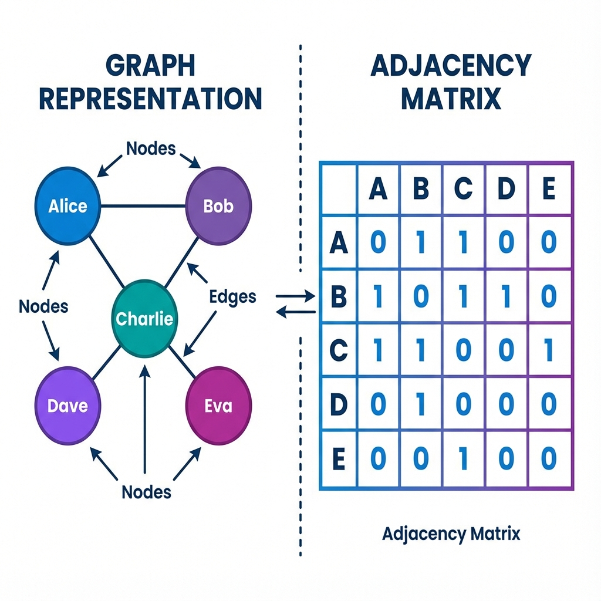

# 🌐 Graph Theory Basics: The Fun Version!

> *Think of a graph like a social network map — dots (people) connected by lines (friendships). That's literally it!*

---

## 🤔 What IS a Graph?

Forget the bar charts and pie charts. In computer science, a **graph** is:

```
    🔴 ─── 🔵
    │       │
    │       │
    🟢 ─── 🟡

Dots = "Nodes" (or vertices)
Lines = "Edges" (connections)
```

**That's it!** A graph is just dots connected by lines.

 

### Real-World Examples

| Example | Nodes (Dots) | Edges (Lines) |
|---------|--------------|---------------|
| 🌐 Facebook | People | Friendships |
| 🐦 Twitter | Users | Follows |
| 🧬 Molecules | Atoms | Chemical bonds |
| 🗺️ Google Maps | Intersections | Roads |
| 🌍 Wikipedia | Pages | Hyperlinks |
| 🎮 Game characters | Players | "Defeated" |

---

## 📊 Types of Graphs

### Directed vs Undirected

**Undirected** = Friendship (if I'm your friend, you're mine)
```
Alice ───── Bob
(Two-way street!)
```

**Directed** = Twitter follow (I can follow you without you following me back 😢)
```
Alice ────→ Bob
(One-way!)
```

### Can Edges Have Values?

**Unweighted** = Just connected or not
```
New York ─── Boston
(They're connected, that's all we know)
```

**Weighted** = Connections have numbers
```
New York ──350km── Boston
(Now we know the distance!)
```

---

## 🔢 How Computers See Graphs

### The Adjacency Matrix (Fancy Grid)

Imagine you have 4 friends: A, B, C, D

```
Who's friends with whom?

    A  B  C  D
A [ 0  1  1  0 ]   ← A is friends with B and C
B [ 1  0  0  1 ]   ← B is friends with A and D
C [ 1  0  0  1 ]   ← C is friends with A and D
D [ 0  1  1  0 ]   ← D is friends with B and C
```

**1 = connected, 0 = not connected**

```python
import numpy as np

# Your friend group!
friends = np.array([
    [0, 1, 1, 0],  # A
    [1, 0, 0, 1],  # B
    [1, 0, 0, 1],  # C
    [0, 1, 1, 0],  # D
])

# How many friends does A have?
print(f"A has {friends[0].sum()} friends")  # Output: 2
```

### The Edge List (Simpler!)

Just list the connections:
```python
friendships = [
    ("A", "B"),
    ("A", "C"),
    ("B", "D"),
    ("C", "D"),
]
```

**PyTorch Geometric uses this format!** (but with numbers)

```python
import torch

# Same friendships, but with numbers (A=0, B=1, C=2, D=3)
edge_index = torch.tensor([
    [0, 0, 1, 2],  # From: A, A, B, C
    [1, 2, 3, 3],  # To:   B, C, D, D
])
```

---

## 📏 Measuring Graphs

### Node Degree = Popularity Contest 🏆

The **degree** of a node = how many connections it has

```
     🌟 Influencer (degree = 5)
    /|\\ \\
   😀😀😀😀😀

     🙂 Regular person (degree = 2)
    / \\
   😀  😀
```

```python
# Quick degree calculation
friends = [[0,1,1], [1,0,1], [1,1,0]]  # 3 people, all connected
degrees = [sum(row) for row in friends]
print(degrees)  # [2, 2, 2] - everyone has 2 friends!
```

### Neighbors = Your Squad 👥

**Neighbors** of a node = all nodes directly connected to it

```
Who are B's neighbors?

    A ─── B ─── C
          │
          D

B's neighbors = {A, C, D}
```

```python
def get_neighbors(node, edges):
    """Find all neighbors of a node."""
    neighbors = []
    for a, b in edges:
        if a == node:
            neighbors.append(b)
        elif b == node:
            neighbors.append(a)
    return neighbors

edges = [("A","B"), ("B","C"), ("B","D")]
print(get_neighbors("B", edges))  # ['A', 'C', 'D']
```

---

## 🎯 The Key Insight for GNNs

Here's the magic idea that makes GNNs work:

> **"You are the average of your 5 closest friends"**
> — Every self-help book ever

GNNs take this literally! 

```
To understand Node A:
1. Look at A's neighbors (B, C, D)
2. Combine their information
3. That tells us about A!

If all your friends are into gaming → you're probably into gaming too!
```

This is called **message passing** — neighbors share information with each other.

---

## 🔄 K-Hop Neighborhoods

**1-hop** = Your direct friends
**2-hop** = Friends of friends  
**3-hop** = Friends of friends of friends

```
You → Your Friends → Their Friends → And so on...

        (2-hop away)    (1-hop away)
              │              │
              ▼              ▼
😀──😀──😀────[YOU]────😀──😀──😀
              ▲              ▲
              │              │
        (1-hop away)    (2-hop away)
```

**The more hops, the more of the network you "see"!**

---

## 🎮 Quick Coding Challenge

Create a simple graph of your favorite characters!

```python
import networkx as nx
import matplotlib.pyplot as plt

# Create a graph
G = nx.Graph()

# Add your favorite characters
G.add_edge("Harry", "Ron")
G.add_edge("Harry", "Hermione")
G.add_edge("Ron", "Hermione")
G.add_edge("Hermione", "Hagrid")
G.add_edge("Harry", "Dumbledore")

# Draw it!
plt.figure(figsize=(8, 6))
nx.draw(G, with_labels=True, node_color='lightblue', 
        node_size=2000, font_size=12, font_weight='bold')
plt.title("Hogwarts Social Network 🧙‍♂️")
plt.savefig("my_first_graph.png")
plt.show()

# Fun stats
print(f"Total characters: {G.number_of_nodes()}")
print(f"Total relationships: {G.number_of_edges()}")
print(f"Harry's friends: {list(G.neighbors('Harry'))}")
```

---

## 🎓 Key Takeaways

| Concept | Plain English |
|---------|---------------|
| **Graph** | Dots connected by lines |
| **Node** | A dot (person, atom, webpage) |
| **Edge** | A line (connection between dots) |
| **Degree** | How many connections a node has |
| **Neighbors** | Nodes directly connected to you |
| **Adjacency Matrix** | A grid showing who's connected |
| **K-hop** | How many steps away something is |

---

## 🚀 What's Next?

Now that you know what graphs ARE, let's learn what makes Graph Neural Networks special!

**[Next: Introduction to GNNs →](./02-intro-to-gnns.md)** 🧠

---

*"Everything is connected. Literally."* 🌐
