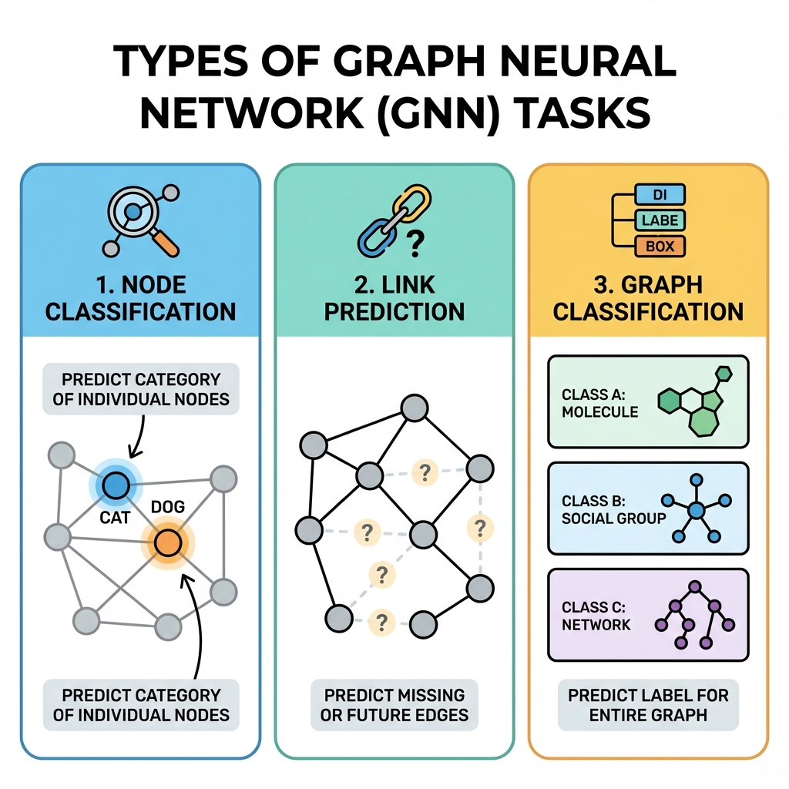

# 🧠 Introduction to Graph Neural Networks

> *"Regular AI looks at things one at a time. GNNs look at things AND their connections. It's like understanding a song by listening to all the instruments together, not just the drums!"*

---

## 🤔 Why Do We Need GNNs?

### The Problem with Normal Neural Networks

Regular neural networks are amazing at:
- 📸 Images (pixels in a grid)
- 📝 Text (words in a sequence)
- 📊 Numbers (tables and spreadsheets)

**But what about THIS?**

```
     😀──😀
    /│    │\\
   😀│    │😀
    └──😀──┘
      
This isn't a grid. It isn't a sequence.
It's a GRAPH — and regular AI can't handle it!
```

### Real Examples Where Connections Matter

| Problem | Why Connections Matter |
|---------|----------------------|
| 🚨 Fraud Detection | Scammers often know each other |
| 💊 Drug Discovery | Molecules are literally atoms connected by bonds |
| 👥 Recommendations | You'll like what your friends like |
| 🦠 Disease Spread | Follows the social network |
| 🎮 Game AI | Characters interact with each other |

---

## 💡 The Big Idea Behind GNNs

### "You Are Who Your Friends Are" 🤝

Think about it:
- If all your friends love pizza → you probably love pizza
- If all your friends are gamers → you're probably a gamer
- If all your friends are bots → you're probably... a bot! 🤖

**GNNs use this principle:**

```
To classify this node (?):

    😀 (gamer)
     │
    😀 (gamer) ── ? ── 😀 (gamer)
                 │
            😀 (gamer)

All neighbors are gamers...
So ? is probably a GAMER too! 🎮
```

---

## 🔄 How GNNs Work: Message Passing

Imagine nodes **texting** each other:

```
Step 1: Everyone sends their info to neighbors

    📱 A: "I like cats"
     │
    📱 B: "I like dogs" ── 📱 C: "I like birds"
     
Step 2: Everyone reads their texts and updates themselves

    A reads: "My neighbor B likes dogs"
    B reads: "A likes cats, C likes birds"
    C reads: "B likes dogs"

Step 3: Everyone now knows about their neighborhood!
```

**This is called "message passing"** — the core of GNNs!

### The Formula (Don't Panic!) 😅

```
New Me = OldMe + AverageOf(What My Friends Said)
```

That's it. Each node updates itself by looking at its neighbors.

---

## 🎯 Three Types of GNN Tasks



### 1. 🔵 Node-Level: "Who is this person?"

Classify individual nodes.

```
Given: A social network
Task: Find the bots 🤖

😀 (human)
😀 (human) ── 🤖 (bot?) ── 🤖 (bot)
```

**Examples:**
- Classify papers by topic
- Detect fake accounts
- Predict user interests

### 2. 🔗 Edge-Level: "Will they connect?"

Predict connections.

```
Given: Current friendships
Task: Who becomes friends next?

Alice ───── Bob
  │          ?        ← Will Bob and Charlie become friends?
Charlie ────┘
```

**Examples:**
- Friend recommendations
- Link prediction in knowledge graphs
- Drug-protein interaction

### 3. 🌐 Graph-Level: "What kind of graph is this?"

Classify entire graphs.

```
Given: A molecule
Task: Is it toxic? ☠️ or Safe? ✅

    O
   /│\\        → "This looks like a toxic molecule!"
  C─C─C
```

**Examples:**
- Molecule property prediction
- Protein function classification
- Malware detection

---

## 🧪 Your First GNN (It's Easy!)

```python
import torch
import torch.nn.functional as F
from torch_geometric.nn import GCNConv
from torch_geometric.datasets import Planetoid

# 1. Load a dataset (academic papers 📄)
dataset = Planetoid(root='./data', name='Cora')
data = dataset[0]

print(f"📊 Papers (nodes): {data.num_nodes}")
print(f"🔗 Citations (edges): {data.num_edges}")
print(f"📝 Words per paper: {data.num_node_features}")
print(f"🏷️ Topics to predict: {dataset.num_classes}")

# 2. Build a simple GNN
class SimpleGNN(torch.nn.Module):
    def __init__(self):
        super().__init__()
        # Two "layers" of message passing
        self.conv1 = GCNConv(data.num_node_features, 16)
        self.conv2 = GCNConv(16, dataset.num_classes)
    
    def forward(self, x, edge_index):
        # Round 1: Pass messages, get excited (ReLU)
        x = self.conv1(x, edge_index)
        x = F.relu(x)
        x = F.dropout(x, training=self.training)
        
        # Round 2: Pass messages again, make prediction
        x = self.conv2(x, edge_index)
        return x

# 3. Train it! 🏋️
model = SimpleGNN()
optimizer = torch.optim.Adam(model.parameters(), lr=0.01)

for epoch in range(200):
    model.train()
    optimizer.zero_grad()
    
    # Forward pass
    out = model(data.x, data.edge_index)
    
    # How wrong were we?
    loss = F.cross_entropy(out[data.train_mask], data.y[data.train_mask])
    
    # Learn from mistakes
    loss.backward()
    optimizer.step()

# 4. Test it! 🧪
model.eval()
pred = model(data.x, data.edge_index).argmax(dim=1)
correct = (pred[data.test_mask] == data.y[data.test_mask]).sum()
accuracy = correct / data.test_mask.sum()

print(f"✅ Accuracy: {accuracy:.1%}")  # Should be ~80%!
```

**Congrats! 🎉 You just trained a GNN!**

---

## 🎨 Visualizing What GNNs Learn

```
BEFORE training:          AFTER training:
(colors = random)         (colors = topics)

   🔴🔵🟢🟡                    🔵🔵🔵🔵
   🟡🔴🔵🟢         →         🔵🔵🔵🔵
   🟢🟡🔴🔵                    🔴🔴   🟢🟢
   🔵🟢🟡🔴                    🔴🔴   🟢🟢

Random mess!               Organized by topic!
```

The GNN learns to organize similar papers together based on their citations!

---

## 🔢 GNN Layers = Hops of Information

Each GNN layer = one round of message passing = looking one hop further

| Layers | What the Node "Sees" |
|--------|---------------------|
| 1 layer | Immediate neighbors |
| 2 layers | Neighbors of neighbors |
| 3 layers | 3 hops away |

```
After 2 layers, Node A knows about E:

    E ─── D ─── C ─── A ─── B
    └─────────────────↗
         2 hops!
```

⚠️ **Warning:** More layers isn't always better! (We'll learn why later)

---

## 🎓 Key Takeaways

| Concept | What It Means |
|---------|---------------|
| **GNN** | Neural network that works on graphs |
| **Message Passing** | Nodes share info with neighbors |
| **Aggregation** | Combining neighbor info into one vector |
| **Layers** | Each layer = one round of message passing |
| **Node Task** | Classify individual nodes |
| **Edge Task** | Predict connections |
| **Graph Task** | Classify whole graphs |

---

## 🚀 What's Next?

You've got the intuition! Now let's dive deeper into how message passing actually works.

**[Next: Message Passing In-Depth →](./03-message-passing.md)** 📨

---

*"In a GNN, no node is an island — everyone learns from everyone!"* 🌐
