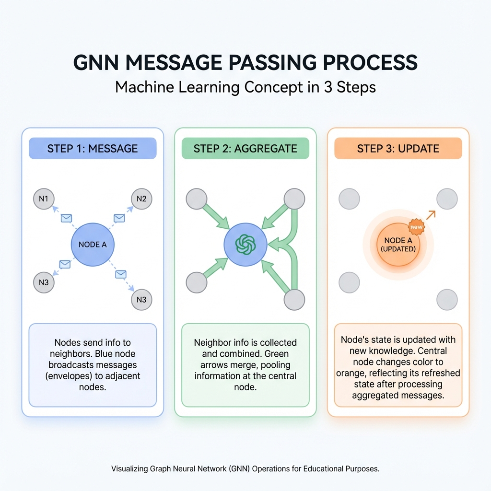

# 📨 Message Passing: The Heart of GNNs

> *"Imagine a game of Telephone, but instead of getting the message wrong, everyone actually gets SMARTER with each round!"*

---

## 🎯 The Core Idea

Remember: **"You are the average of your 5 closest friends"**

GNNs take this literally using **Message Passing**:

```
Round 1: 
  📤 Every node sends a "message" to its neighbors
  📥 Every node receives messages from its neighbors
  🧠 Every node updates itself based on what it learned

Round 2: 
  🔄 Repeat!
  (Now messages carry info from 2 hops away)

Round 3:
  🔄 Repeat again!
  (Now 3 hops away!)
```

---

## 📬 The Three Steps



### Step 1: 📤 MESSAGE — What do I tell my neighbors?

Each node creates a message based on its features.

```
Node A (features: "I like cats")
  → Message: [0.8, 0.2, 0.5, ...]  (some number vector)
```

### Step 2: 📥 AGGREGATE — Combine what neighbors said

Each node collects messages from ALL neighbors and combines them.

```
Node B receives messages from A, C, D:
  Message from A: [0.8, 0.2, 0.5]
  Message from C: [0.3, 0.9, 0.2]
  Message from D: [0.5, 0.5, 0.5]
  
Combined (average): [0.53, 0.53, 0.4]
```

### Step 3: 🔄 UPDATE — Learn from neighbors

Mix the combined message with your own features.

```
Node B's old features: [1.0, 0.0, 1.0]
Combined from neighbors: [0.53, 0.53, 0.4]

New B = NeuralNetwork(old_B + combined)
      = [0.7, 0.3, 0.8]  ← Updated!
```

---

## 🎮 The Classroom Analogy

Imagine a classroom where:
- 👦 Each student knows something different
- 📝 Every round, students share notes with seatmates
- 🧠 After sharing, everyone knows a little about everything!

```
Before:
  👦 "I know Math"    👧 "I know Science"    👦 "I know History"

After 1 Round:
  👦 "I know Math +       👧 "I know Science +    👦 "I know History +
      a bit of Science"        Math + History"         Science"

After 2 Rounds:
  Everyone knows a bit about everything! 🎓
```

---

## 🧮 Aggregation Functions: How to Combine Messages

### SUM ➕ — "More is more!"

Just add everything up.

```python
combined = sum(neighbor_messages)

# Good when: count matters (more friends = more popular)
# Bad when: comparing nodes with different degrees
```

### MEAN 📊 — "Take the average"

Add and divide by count.

```python
combined = sum(neighbor_messages) / len(neighbors)

# Good when: comparing nodes fairly
# Bad when: you need to know the actual count
```

### MAX 🏆 — "Only the best"

Keep only the maximum value per dimension.

```python
combined = max(neighbor_messages)  # element-wise

# Good when: one strong signal is enough
# Bad when: you need to count things
```

### Which Should You Use?

| Aggregation | Best For | Think Of It As... |
|-------------|----------|-------------------|
| **SUM** | Counting, size-aware tasks | "Votes" |
| **MEAN** | Fair comparison | "Average opinion" |
| **MAX** | Detecting any presence | "Loudest voice" |

---

## 🐍 Code: Build Your Own Message Passing Layer!

```python
import torch
import torch.nn as nn
import torch.nn.functional as F

class MyMessagePassingLayer(nn.Module):
    """Your very own GNN layer! 🎉"""
    
    def __init__(self, in_features, out_features):
        super().__init__()
        # A simple neural network for transforming features
        self.transform = nn.Linear(in_features, out_features)
    
    def forward(self, x, edge_index):
        """
        x: Node features [num_nodes, features]
        edge_index: Who's connected [2, num_edges]
        """
        num_nodes = x.size(0)
        
        # Step 1: MESSAGE 📤
        # Transform each node's features into a "message"
        messages = self.transform(x)
        
        # Step 2: AGGREGATE 📥
        # Initialize empty "mailbox" for each node
        mailbox = torch.zeros(num_nodes, messages.size(1))
        
        # Deliver messages!
        source_nodes = edge_index[0]  # Who's sending
        target_nodes = edge_index[1]  # Who's receiving
        
        # Add each source's message to target's mailbox
        for src, tgt in zip(source_nodes, target_nodes):
            mailbox[tgt] += messages[src]
        
        # Step 3: UPDATE 🔄
        # Combine mailbox with original features
        output = F.relu(mailbox + messages)  # Skip connection!
        
        return output

# Test it!
x = torch.randn(4, 8)  # 4 nodes, 8 features each
edges = torch.tensor([[0,1,2], [1,2,3]])  # 0→1, 1→2, 2→3

layer = MyMessagePassingLayer(8, 16)
output = layer(x, edges)
print(f"Input shape: {x.shape}")
print(f"Output shape: {output.shape}")
```

**You just built a GNN layer from scratch! 🎉**

---

## 🚀 Using PyG (The Easy Way)

```python
from torch_geometric.nn import MessagePassing

class EasyGNNLayer(MessagePassing):
    """Same thing, but cleaner!"""
    
    def __init__(self, in_features, out_features):
        super().__init__(aggr='mean')  # Use mean aggregation
        self.transform = nn.Linear(in_features, out_features)
    
    def forward(self, x, edge_index):
        # This automatically handles message passing!
        return self.propagate(edge_index, x=x)
    
    def message(self, x_j):
        # x_j = features of the SOURCE node
        return self.transform(x_j)
    
    def update(self, aggr_out, x):
        # aggr_out = aggregated messages
        return F.relu(aggr_out + self.transform(x))
```

---

## ⚠️ The Over-Smoothing Problem

**What happens with too many layers?**

```
Layer 1: Nodes know about 1-hop neighbors
Layer 2: Nodes know about 2-hop neighbors  
Layer 5: Nodes know about 5-hop neighbors
Layer 10: Everyone knows about EVERYONE
Layer 20: Everyone looks THE SAME! 😱
```

This is called **Over-Smoothing** — like mixing all paint colors together until everything is brown.

### The Solution

Most GNNs only use **2-3 layers**. That's usually enough!

```python
class GoodGNN(nn.Module):
    def __init__(self):
        super().__init__()
        self.conv1 = GCNConv(16, 32)  # Layer 1
        self.conv2 = GCNConv(32, 16)  # Layer 2
        # That's it! 2 layers is often plenty.
```

---

## 🎓 Quiz Yourself!

1. **What are the 3 steps of message passing?**
   <details>
   <summary>Answer</summary>
   MESSAGE → AGGREGATE → UPDATE
   </details>

2. **Which aggregation would you use to count neighbors?**
   <details>
   <summary>Answer</summary>
   SUM (because mean divides by count)
   </details>

3. **Why don't we use 100 GNN layers?**
   <details>
   <summary>Answer</summary>
   Over-smoothing! All nodes start looking the same.
   </details>

---

## 🎯 Key Takeaways

| Concept | Plain English |
|---------|---------------|
| **Message** | What nodes tell their neighbors |
| **Aggregate** | Combining all incoming messages |
| **Update** | Using messages to improve yourself |
| **Sum/Mean/Max** | Different ways to combine messages |
| **Over-smoothing** | Too many layers = everyone looks the same |
| **2-3 layers** | Usually all you need! |

---

## 🚀 What's Next?

You understand the foundation! Now let's see the famous architectures that revolutionized GNNs.

**[Next: GCN — The Founding Father →](../02-Core-Architectures/01-gcn.md)** 🏆

---

*"Pass the message, share the knowledge, learn together!"* 📬
