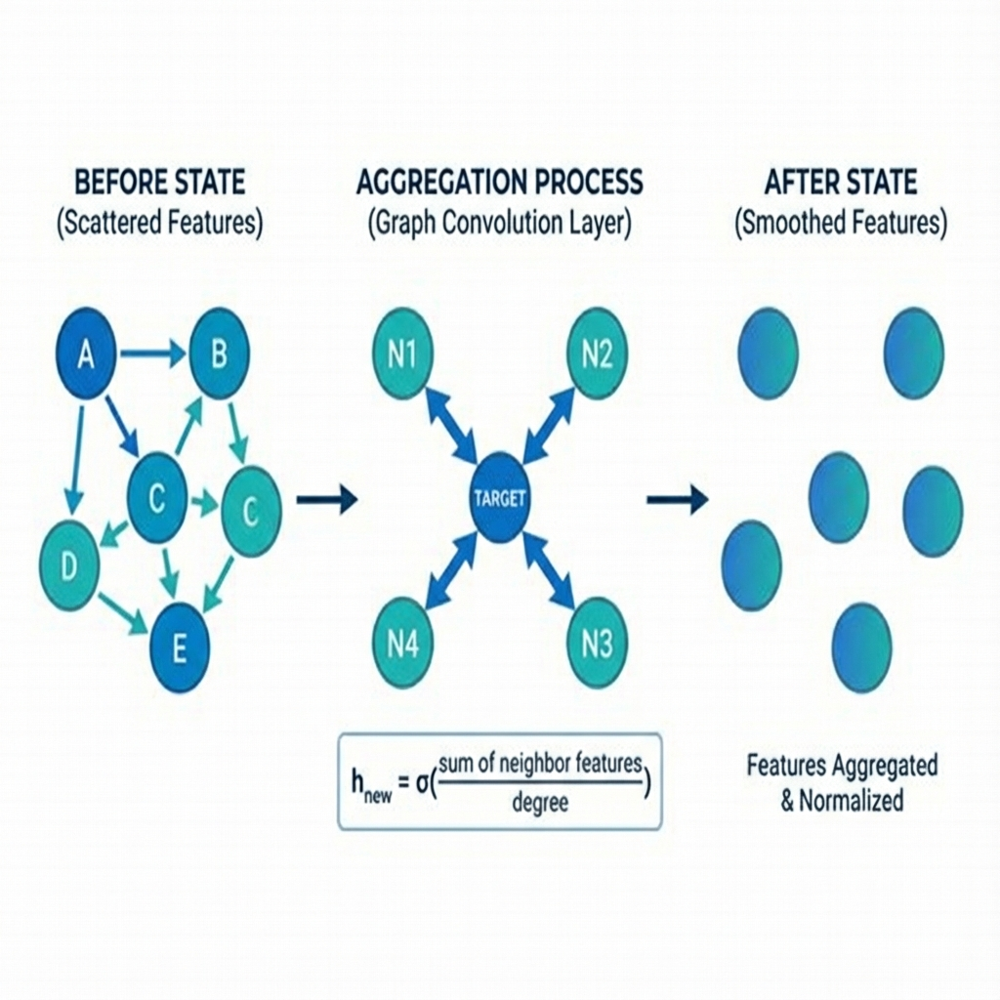

# 🏛️ Graph Convolutional Networks (GCN)

> *"GCN is like a town hall meeting where everyone gets equal speaking time, regardless of how popular they are!"*

**Paper:** "Semi-Supervised Classification with Graph Convolutional Networks" (Kipf & Welling, 2017)

---

## 📖 The Story So Far

In the previous lessons, you learned:
1. ✅ **Graphs** = Nodes + Edges (like social networks)
2. ✅ **GNNs** = Neural networks that work on graphs
3. ✅ **Message Passing** = Nodes share information with neighbors

**Now:** Let's meet the first famous GNN architecture — the one that started the revolution! 🚀



---

## 🤔 What Makes GCN Special?

### The Democratic Approach 🗳️

GCN treats all your neighbors equally (sort of):

```
Imagine you're at a party 🎉

You want to know: "What music does everyone like?"

GCN approach:
  - Ask EVERY friend at the party
  - Each friend's opinion counts equally
  - Average all answers
  - That's your new understanding of music taste!
```

### The Formula (Don't Panic!)

For each node, GCN does this:

```
new_me = activate( average_of(my_neighbors + myself) × weights )
```

Or more formally:
```
h_v^(new) = ReLU( W × mean(h_u for all neighbors u, including v) )
```

**That's it!** Average neighbors, multiply by learnable weights, activate.

---

## 🎯 Key Insight: The Smoothing Effect

### What Happens When You Average Neighbors?

```
Before GCN:              After GCN:
                         
😊 = "I love rock"       😊 = "I kinda like rock, 
😎 = "I love jazz"            jazz, and pop"
😄 = "I love pop"        😎 = "I kinda like rock,
                              jazz, and pop"
When friends share,      😄 = "I kinda like rock,
everyone becomes              jazz, and pop"
more similar!            
                         Everyone "smoothed" out!
```

This is actually GCN's **superpower** AND its **weakness**:
- ✅ **Good:** Similar nodes become more similar (easier to classify!)
- ❌ **Bad:** Too much smoothing = everyone looks the same (over-smoothing)

---

## 🧮 The Math Made Simple

### Step 1: Add Self-Loops

Before averaging neighbors, GCN adds each node as its own neighbor:

```python
# Original: A knows B, B knows C
# Add self-loops: A knows A, B knows B, C knows C

à = A + I  # Adjacency + Identity matrix
```

**Why?** So you don't lose yourself in the crowd!

### Step 2: Normalize by Degree

Problem: Popular nodes have more neighbors → bigger values!

```
Celebrity (1000 friends): sum = HUGE
Regular person (5 friends): sum = small

Not fair! 😤
```

Solution: **Symmetric Normalization**

```python
# Divide by sqrt(degree of sender) × sqrt(degree of receiver)
# This keeps values balanced
```

### Step 3: Transform & Activate

```python
# Multiply by learnable weights
# Apply ReLU activation
output = ReLU(normalized_neighbor_aggregate @ W)
```

---

## 🐍 Code: GCN in 10 Lines

```python
import torch
import torch.nn.functional as F
from torch_geometric.nn import GCNConv

class SimpleGCN(torch.nn.Module):
    def __init__(self, in_features, hidden, out_features):
        super().__init__()
        self.conv1 = GCNConv(in_features, hidden)   # First message pass
        self.conv2 = GCNConv(hidden, out_features)  # Second message pass
    
    def forward(self, x, edge_index):
        x = self.conv1(x, edge_index)  # Aggregate neighbors
        x = F.relu(x)                   # Activate
        x = F.dropout(x, training=self.training)  # Regularize
        x = self.conv2(x, edge_index)  # Aggregate again
        return x

# That's a full GCN! 🎉
```

---

## 🧪 Full Training Example

```python
from torch_geometric.datasets import Planetoid

# Load the famous Cora dataset (research papers)
dataset = Planetoid(root='./data', name='Cora')
data = dataset[0]

print(f"📚 Papers: {data.num_nodes}")
print(f"🔗 Citations: {data.num_edges}")
print(f"📊 Topics: {dataset.num_classes}")

# Build model
model = SimpleGCN(dataset.num_features, 16, dataset.num_classes)
optimizer = torch.optim.Adam(model.parameters(), lr=0.01)

# Train!
for epoch in range(200):
    model.train()
    optimizer.zero_grad()
    
    out = model(data.x, data.edge_index)
    loss = F.cross_entropy(out[data.train_mask], data.y[data.train_mask])
    
    loss.backward()
    optimizer.step()

# Test
model.eval()
pred = model(data.x, data.edge_index).argmax(dim=1)
acc = (pred[data.test_mask] == data.y[data.test_mask]).float().mean()
print(f"✅ Accuracy: {acc:.1%}")  # ~81%
```

---

## ⚖️ GCN: Strengths & Weaknesses

### ✅ Why GCN is Great

| Strength | Why It Matters |
|----------|----------------|
| **Simple** | Easy to understand and implement |
| **Fast** | O(edges) complexity — scales well |
| **Solid baseline** | Often surprisingly hard to beat |
| **Well-studied** | Lots of theory and extensions |

### ❌ GCN's Limitations

| Limitation | The Problem | Solution Coming! |
|------------|-------------|-----------------|
| **Everyone equal** | All neighbors same weight | → **GAT** (next lesson!) |
| **Can't handle new nodes** | Must retrain for new data | → **GraphSAGE** (after GAT) |
| **Over-smoothing** | Deep networks fail | → Advanced techniques |

---

## 🌉 Connection to What's Next

GCN's biggest limitation: **all neighbors treated equally**.

But think about your real friends:
- 🧠 Your smart friend's opinion on coding → HIGH weight
- 🎨 Your artist friend's opinion on coding → LOWER weight

**What if we could LEARN which neighbors matter more?**

That's exactly what **Graph Attention Networks (GAT)** do!

---

## 🎓 Key Takeaways

| Concept | Remember This |
|---------|---------------|
| **GCN aggregation** | Average of neighbors (equally weighted) |
| **Self-loops** | Include yourself when averaging |
| **Normalization** | Balance popular vs. unpopular nodes |
| **2 layers typical** | More = over-smoothing risk |
| **Strength** | Simple, fast, proven |
| **Weakness** | All neighbors equal weight |

---

## 🎮 Quick Quiz

1. **Why does GCN add self-loops?**
   <details>
   <summary>Answer</summary>
   So you don't lose your own information when averaging neighbors!
   </details>

2. **What's the "smoothing effect"?**
   <details>
   <summary>Answer</summary>
   Neighbors become more similar after message passing — features get averaged out.
   </details>

3. **Why only 2-3 GCN layers?**
   <details>
   <summary>Answer</summary>
   More layers = more smoothing = all nodes look the same (over-smoothing)!
   </details>

---

**Ready to give different neighbors different importance?**

👉 **[Next: Graph Attention Networks (GAT) →](./02-gat.md)** 🎯

---

*"GCN: The democracy of neural networks — everyone gets an equal vote!"* 🗳️
