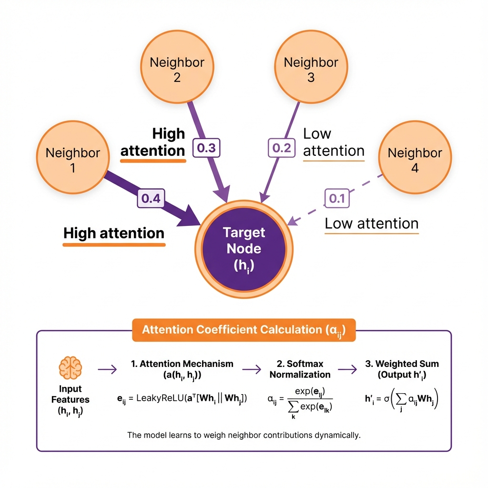

# 🎯 Graph Attention Networks (GAT)

> *"GAT is like listening to advice from friends — but paying MORE attention to the friend who actually knows what they're talking about!"*

**Paper:** "Graph Attention Networks" (Veličković et al., 2018)

---

## 📖 The Story So Far

In the previous lesson ([GCN](./01-gcn.md)), you learned:
- ✅ GCN averages neighbors **equally**
- ❌ But wait... not all neighbors are equally important!

**The Problem:**
```
You want cooking advice 🍳

Friend A: Professional chef 👨‍🍳
Friend B: Burns water 😅

GCN: "Average their opinions!"
You: "That's... not smart."
```

**GAT's Solution:** Learn to pay **attention** to who matters! 🧠



---

## 💡 The Big Idea: Learned Attention

### From Equal to Weighted

| GCN | GAT |
|-----|-----|
| h = average(neighbors) | h = **weighted** average(neighbors) |
| All friends count equally | Smart friends count more |
| Fixed weights (by degree) | **Learned** weights (attention) |

### Visual Comparison

```
GCN (everyone equal):              GAT (attention weights):

    B (0.33)                           B (0.5) ← "Very relevant!"
     \                                  \
      A (0.33)                           A (0.3)
     /                                  /
    C (0.33)                           C (0.2) ← "Less relevant"
    
    All same weight!                   Weights learned!
```

---

## 🔍 How Attention Works

### Step 1: Transform Features

First, transform each node's features:

```python
h'_A = W × h_A  # Learn a representation for A
h'_B = W × h_B  # Learn a representation for B
```

### Step 2: Compute "Compatibility" Score

For each pair (A, B), ask: "How relevant is B to A?"

```python
# Concatenate their features, pass through attention
e_AB = LeakyReLU( attention_vector · [h'_A || h'_B] )

# e_AB = "How much should A listen to B?"
```

### Step 3: Normalize with Softmax

Make sure attention weights sum to 1:

```python
α_AB = softmax(e_AB) = exp(e_AB) / Σ exp(e_AX) for all neighbors X

# Now: α_AB + α_AC + α_AD = 1.0
```

### Step 4: Weighted Aggregation

```python
h_new = Σ α_Au × h'_u  # Weighted sum

# Pay more attention to high-α neighbors!
```

---

## 🎭 Multi-Head Attention: Multiple Perspectives

Just like Transformers, GAT uses **multiple attention heads**:

```
Head 1: "What do neighbors think about TOPIC A?"
Head 2: "What do neighbors think about TOPIC B?"
Head 3: "What do neighbors think about TOPIC C?"
...

Final answer = Combine all heads!
```

### Why Multiple Heads?

```
Imagine you're deciding what movie to watch 🎬

Head 1: Asks friends about GENRE preference
Head 2: Asks friends about ACTOR preference  
Head 3: Asks friends about RUNTIME preference

More heads = More perspectives = Better decision!
```

```python
# 8 heads, each looking at the graph differently
self.conv1 = GATConv(in_features, 8, heads=8)

# Output: 8 different attention patterns!
```

---

## 🐍 Code: GAT in Action

```python
import torch
import torch.nn.functional as F
from torch_geometric.nn import GATConv

class SimpleGAT(torch.nn.Module):
    def __init__(self, in_features, hidden, out_features, heads=8):
        super().__init__()
        # 8 attention heads in first layer
        self.conv1 = GATConv(in_features, hidden, heads=heads, dropout=0.6)
        # 1 head in output layer (average, don't concatenate)
        self.conv2 = GATConv(hidden * heads, out_features, heads=1, 
                             concat=False, dropout=0.6)
    
    def forward(self, x, edge_index):
        x = F.dropout(x, p=0.6, training=self.training)
        x = self.conv1(x, edge_index)
        x = F.elu(x)  # ELU activation (GAT's preference)
        x = F.dropout(x, p=0.6, training=self.training)
        x = self.conv2(x, edge_index)
        return x
```

### Training Example

```python
from torch_geometric.datasets import Planetoid

dataset = Planetoid(root='./data', name='Cora')
data = dataset[0]

model = SimpleGAT(dataset.num_features, 8, dataset.num_classes)
optimizer = torch.optim.Adam(model.parameters(), lr=0.005)

for epoch in range(200):
    model.train()
    optimizer.zero_grad()
    out = model(data.x, data.edge_index)
    loss = F.cross_entropy(out[data.train_mask], data.y[data.train_mask])
    loss.backward()
    optimizer.step()

# Test
model.eval()
pred = model(data.x, data.edge_index).argmax(dim=1)
acc = (pred[data.test_mask] == data.y[data.test_mask]).float().mean()
print(f"✅ Accuracy: {acc:.1%}")  # ~83% (better than GCN!)
```

---

## 👁️ Visualizing Attention

GAT's **superpower**: You can SEE which neighbors it pays attention to!

```python
# Get attention weights
conv = GATConv(16, 8, heads=4)
out, (edge_index, attention) = conv(x, edge_index, return_attention_weights=True)

# attention[i] = how much node i attends to its neighbors
print(f"Attention shape: {attention.shape}")  # [num_edges, num_heads]

# Visualize: Thicker edges = higher attention
```

```
Visualization:

    Node A's attention:
    
    B ══════════> A  (α = 0.6, thick line = high attention)
    C ──────────> A  (α = 0.3, medium line)
    D ·········> A   (α = 0.1, thin line = low attention)
    
    "B is most important to A!"
```

---

## 🆚 GATv2: The Improved Version

**Problem with original GAT:** Attention is "static" — can't fully express complex patterns.

**Paper:** "How Attentive are Graph Attention Networks?" (Brody et al., 2021)

```python
# GAT (original):  a^T [Wh_i || Wh_j]      ← Linear, then concat
# GATv2:           a^T LeakyReLU(W[h_i || h_j])  ← Concat, then nonlinear

from torch_geometric.nn import GATv2Conv  # Just swap!

class BetterGAT(torch.nn.Module):
    def __init__(self, in_features, hidden, out_features):
        super().__init__()
        self.conv1 = GATv2Conv(in_features, hidden, heads=8)  # ← v2!
        self.conv2 = GATv2Conv(hidden * 8, out_features, heads=1, concat=False)
```

---

## ⚖️ GAT: Strengths & Weaknesses

### ✅ Why GAT is Awesome

| Strength | Why It Matters |
|----------|----------------|
| **Learned importance** | Smart neighbors count more |
| **Interpretable** | Can visualize attention! |
| **Expressive** | Captures complex patterns |
| **Multi-head** | Multiple perspectives |

### ❌ GAT's Limitations

| Limitation | The Problem | Next Solution |
|------------|-------------|---------------|
| **Still transductive** | Can't handle new nodes | → **GraphSAGE** |
| **More parameters** | Needs more training data | Use regularization |
| **Slower than GCN** | Attention is expensive | Accept the tradeoff |

---

## 🌉 Connection to What's Next

GAT solves the "equal neighbors" problem of GCN, BUT:

```
Problems remaining:

1. New node joins the network → Can't classify! 🆕
2. Graph has 10 million nodes → Can't fit in memory! 💾
3. Need real-time prediction → Can't retrain! ⏰
```

**What if we could:**
- ✅ Handle new nodes without retraining
- ✅ Scale to massive graphs
- ✅ Learn a FUNCTION instead of fixed embeddings

That's exactly what **GraphSAGE** does!

---

## 🎓 Key Takeaways

| Concept | Remember This |
|---------|---------------|
| **Attention** | Learn which neighbors matter more |
| **α weights** | Importance scores (sum to 1) |
| **Multi-head** | Multiple attention patterns |
| **ELU activation** | GAT's preferred activation |
| **Interpretable** | Can visualize attention weights |
| **vs GCN** | More expressive, but slower |

---

## 🎮 Quick Quiz

1. **What's the key difference between GCN and GAT?**
   <details>
   <summary>Answer</summary>
   GCN weights neighbors by degree (fixed). GAT LEARNS attention weights!
   </details>

2. **Why use multiple attention heads?**
   <details>
   <summary>Answer</summary>
   Multiple perspectives on the graph — like asking different questions about neighbors.
   </details>

3. **What can you DO with attention weights?**
   <details>
   <summary>Answer</summary>
   Visualize them! See which neighbors the model finds important.
   </details>

---

**Ready to handle new nodes and scale to millions?**

👉 **[Next: GraphSAGE →](./03-graphsage.md)** 🚀

---

*"GAT: Not all friends are equal — learn who to listen to!"* 👂
