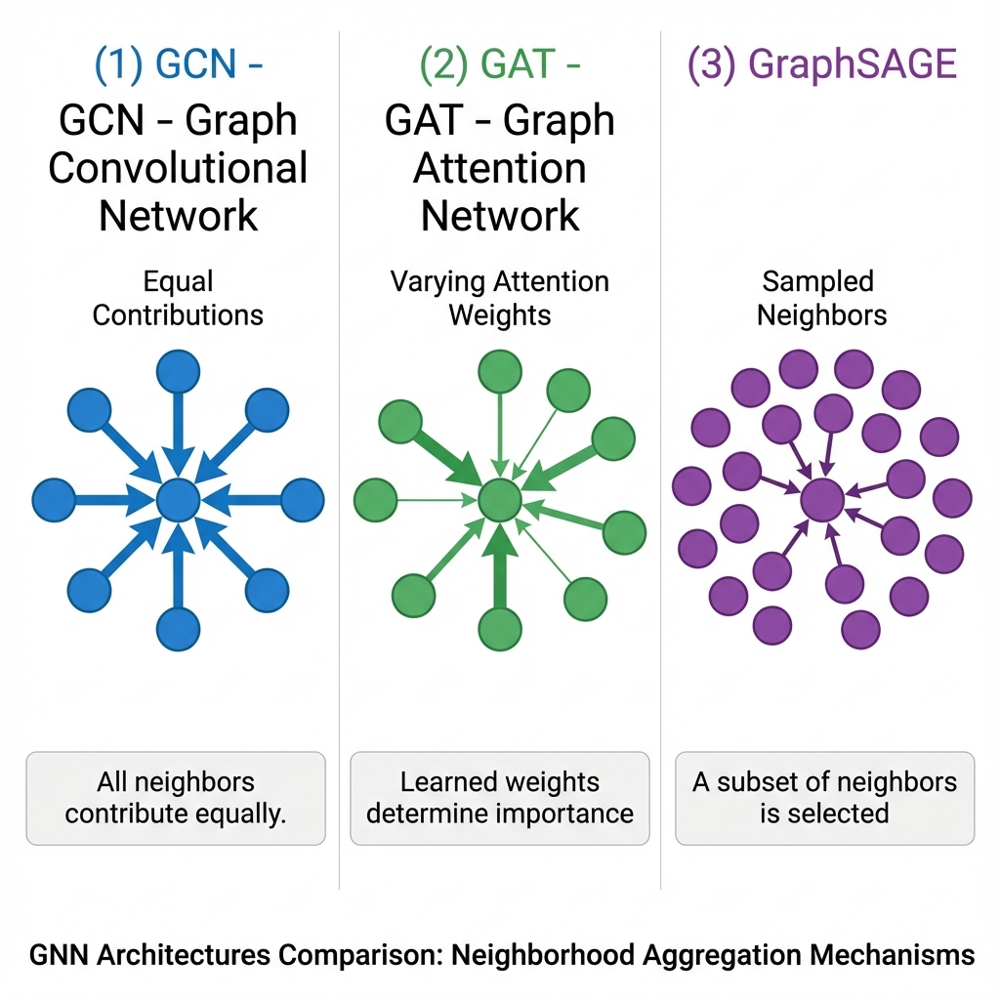

# 📊 GNN Architecture Showdown!

> *"GCN, GAT, GraphSAGE — like choosing between a minivan, sports car, and SUV. Each is best for different roads!"*

---

## 🗺️ Your Journey So Far

```
📚 You've learned 3 powerful architectures:

┌──────────────────────────────────────────────────────────────┐
│                                                              │
│  GCN ────────────▶ GAT ────────────▶ GraphSAGE              │
│  (Equal votes)     (Smart votes)     (Works anywhere!)       │
│                                                              │
│  "Everyone equal"  "Learn who        "Learn HOW to          │
│                     matters"          make friends"          │
│                                                              │
└──────────────────────────────────────────────────────────────┘
```

**Now let's put them HEAD TO HEAD!** 🥊



---

## 🏆 The Ultimate Comparison Table

| Feature | GCN 🏛️ | GAT 🎯 | GraphSAGE 🚀 |
|---------|--------|--------|--------------|
| **Core Idea** | Average neighbors | Attention-weighted | Sample + aggregate |
| **Neighbor Weights** | Fixed (by degree) | Learned | Flexible |
| **New Nodes** | ❌ Must retrain | ❌ Must retrain | ✅ Works instantly! |
| **Scalability** | ⚠️ Medium | ⚠️ Medium | ✅ Excellent |
| **Interpretability** | ⚠️ Limited | ✅ Attention visible | ⚠️ Limited |
| **Speed** | ✅ Fastest | ⚠️ Slower | ✅ Fast (with sampling) |
| **Parameters** | Fewest | Most | Medium |
| **Memory** | High (full graph) | Higher | Low (mini-batch) |
| **Best Era** | 2017 | 2018 | 2017 |

---

## 🎯 When to Use Each

### 🏛️ Use GCN When:

```
✅ You want a simple, proven baseline
✅ Your graph is small-medium (fits in memory)
✅ Nodes are similar to their neighbors (homophily)
✅ You're prototyping or learning
✅ Need fast training and inference

❌ NOT when:
   - Neighbors have different importance
   - New nodes keep appearing
   - Graph has millions of nodes
```

**Think: "Town hall meeting — everyone gets equal voice"**

---

### 🎯 Use GAT When:

```
✅ Different neighbors have different importance
✅ You need to EXPLAIN which neighbors matter
✅ Working with heterogeneous relationships
✅ Have enough training data (more parameters)
✅ Interpretability is important

❌ NOT when:
   - Memory is very constrained
   - All neighbors truly are equal
   - Simple baseline is sufficient
```

**Think: "Expert panel — some opinions count more"**

---

### 🚀 Use GraphSAGE When:

```
✅ New nodes appear constantly
✅ Graph is HUGE (millions of nodes)
✅ Need real-time predictions
✅ Building production systems
✅ Graph evolves over time

❌ NOT when:
   - Graph is small and static
   - You want attention interpretability
   - All nodes known at training time
```

**Think: "Social media — new users join every second"**

---

## 📈 Performance Benchmarks

### Cora Dataset (Citation Network)
*2,708 nodes, 5,429 edges, 7 classes*

| Model | Test Accuracy | Training Time |
|-------|--------------|---------------|
| GCN | 81.5% | ⚡ Fastest |
| GAT | **83.0%** | Medium |
| GraphSAGE | 82.3% | Fast |

### Reddit Dataset (Social Network)
*233K nodes, 114M edges, 41 classes*

| Model | Test Accuracy | Memory Usage |
|-------|--------------|--------------|
| GCN | OOM 💥 | > 32 GB |
| GAT | OOM 💥 | > 48 GB |
| **GraphSAGE** | 95.4% | ~4 GB |

**Verdict:** Small graph = GCN/GAT fine. Big graph = GraphSAGE wins!

---

## 🧠 Expressiveness: GIN Edition

There's a fourth architecture worth knowing: **GIN (Graph Isomorphism Network)**

```
GIN's claim: "I'm as powerful as theoretically possible!"

Based on: Weisfeiler-Lehman (WL) graph isomorphism test
```

| Model | Expressiveness | Best For |
|-------|---------------|----------|
| GCN | < 1-WL | General use |
| GAT | < 1-WL | Attention needed |
| GraphSAGE | ≤ 1-WL | Large/dynamic |
| **GIN** | **= 1-WL** | Graph classification |

```python
from torch_geometric.nn import GINConv

# GIN uses a MLP instead of simple linear
mlp = nn.Sequential(nn.Linear(16, 32), nn.ReLU(), nn.Linear(32, 16))
conv = GINConv(mlp)
```

**Use GIN for:** Graph-level tasks (molecule classification)

---

## 🔧 Quick Code Comparison

### Same Task, Three Models

```python
from torch_geometric.nn import GCNConv, GATConv, SAGEConv

# 🏛️ GCN
class GCN(nn.Module):
    def __init__(self):
        super().__init__()
        self.conv1 = GCNConv(in_dim, hidden)
        self.conv2 = GCNConv(hidden, out_dim)

# 🎯 GAT  
class GAT(nn.Module):
    def __init__(self):
        super().__init__()
        self.conv1 = GATConv(in_dim, hidden // 8, heads=8)
        self.conv2 = GATConv(hidden, out_dim, heads=1)

# 🚀 GraphSAGE
class SAGE(nn.Module):
    def __init__(self):
        super().__init__()
        self.conv1 = SAGEConv(in_dim, hidden)
        self.conv2 = SAGEConv(hidden, out_dim)

# All use the same forward pattern!
def forward(self, x, edge_index):
    x = F.relu(self.conv1(x, edge_index))
    x = F.dropout(x, training=self.training)
    x = self.conv2(x, edge_index)
    return x
```

**Notice:** The interface is identical! Easy to swap and compare.

---

## 🎮 Decision Flowchart

```
START HERE
    │
    ▼
🆕 New nodes need predictions?
    ├─ YES ──────────────────────────▶ 🚀 GraphSAGE
    │
    NO
    │
    ▼
📏 Graph > 100K nodes?
    ├─ YES ──────────────────────────▶ 🚀 GraphSAGE + sampling
    │
    NO
    │
    ▼
🔍 Need to see which neighbors matter?
    ├─ YES ──────────────────────────▶ 🎯 GAT
    │
    NO
    │
    ▼
🧪 Graph-level classification?
    ├─ YES ──────────────────────────▶ 🧠 GIN
    │
    NO
    │
    ▼
🏛️ Start with GCN! (solid baseline)
```

---

## 🌟 Advanced: Combining Strengths

### GAT + Sampling (Best of Both)

```python
from torch_geometric.loader import NeighborLoader
from torch_geometric.nn import GATConv

# Use GAT architecture
model = GAT(...)

# But train with GraphSAGE-style sampling
loader = NeighborLoader(data, num_neighbors=[25, 10], batch_size=512)
```

### GATv2 + GraphSAGE Ideas

```python
from torch_geometric.nn import GATv2Conv

# GATv2 (fixed attention) + mini-batch training
# = Scalable attention!
```

---

## 🎓 Final Summary

| If You Need... | Use This |
|---------------|----------|
| **Simple baseline** | GCN 🏛️ |
| **Interpretable attention** | GAT 🎯 |
| **Scale or new nodes** | GraphSAGE 🚀 |
| **Graph classification** | GIN 🧠 |
| **Production system** | GraphSAGE + sampling 🏭 |

---

## 🚀 What's Next?

You've mastered the core architectures! But there's more to learn:

```
Coming up in Advanced Concepts:

📚 Over-smoothing → Why deep GNNs fail
📚 Heterogeneous graphs → Different node/edge types
📚 Temporal GNNs → Graphs that change over time
📚 Graph Transformers → Attention everywhere!
```

---

**Ready to go deeper?**

👉 **[Next Module: Advanced Concepts →](../03-Advanced-Concepts/01-over-smoothing.md)** 🧠

---

*"Three tools, three superpowers — now you know when to use each!"* 🛠️
